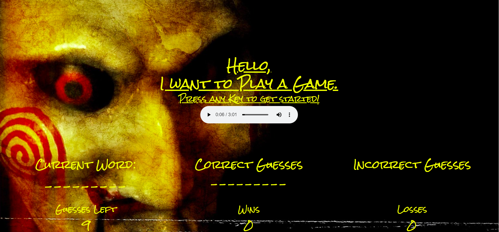
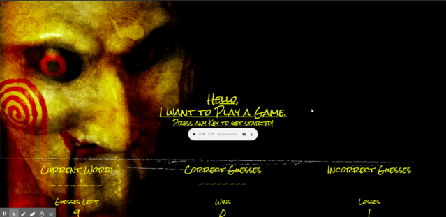

# [Word-Guess-Game](https://armonkahil.github.io/Word-Guess-Game/)

## Overview
This is a simple hangman game written in Javascript. But by no means is the game simple. I made this game as difficult as possible by including 1,291 of the hardest words in the English dictionary. This list I compiled, combined the most difficult words from International Spelling Bees, [GRE Vocabulary Study Guides](https://www.kaptest.com/study/gre/top-52-gre-vocabulary-words/GRE), and [Dr. Robert Heckendorn's List of Hard to Spell Words](http://marvin.cs.uidaho.edu/misspell.html). I chose a theme that I felt correlated in the design and aim of this game: [The Saw Movie Series](https://en.wikipedia.org/wiki/Saw_(franchise)).

## Instructions
- Press any key to start
- 9 Chances to guess the word
- When out of guesses or get lucky, the game restarts.
## [Check out the demo hosted on Heroku](https://armonkahil.github.io/Word-Guess-Game/)

